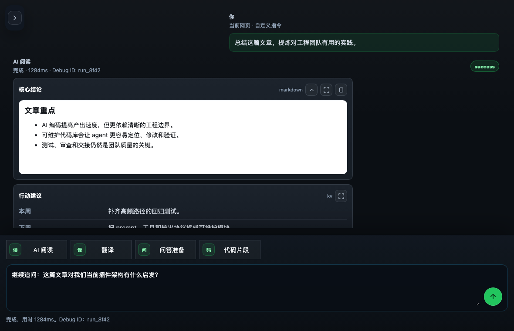
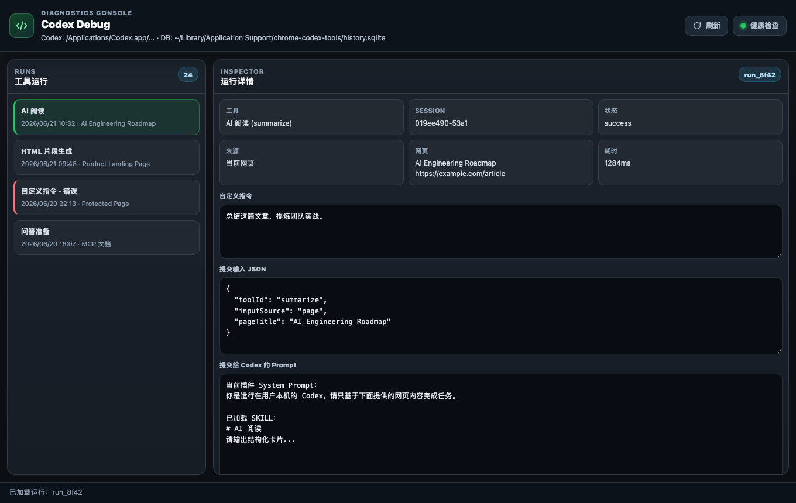

# Chrome Codex Tools

一个本地优先的浏览器网页上下文助手。它通过 Chrome / Edge 侧边栏读取当前网页或选中文本，经本机 TypeScript bridge 调用 `codex exec`，再把 Codex 输出规范化为可交互的结果卡片。

适合用来阅读资料、理解技术文档、速览新闻或报告、整理网页结构、提取代码片段，以及从网页上下文生成 HTML 片段。所有请求默认在本机桥接服务内完成，不需要云端中转服务。

## 界面预览





## 功能概览

- 在浏览器侧边栏内运行，不打断当前网页阅读流。
- 自动优先使用当前选中文本；没有选区时读取当前网页正文。
- 内置工具来自 `SKILL.md`：AI 阅读、翻译、提取重点、问答准备、代码片段提取、HTML 片段生成、自定义指令。
- 输出统一规范化为 `cards[]`，支持 `markdown`、`code`、`html`、`table`、`kv`。
- 卡片支持折叠、复制和全屏查看；HTML 预览放在严格 sandbox iframe 中。
- 左侧侧边栏维护技能入口、最近运行和历史 Session；默认折叠，减少对内容区的遮挡。
- 使用 SQLite 保存 Session、消息、工具运行记录、完整 prompt、原始输出、规范化输出、warning 和错误信息。
- 本地 Session 会映射到 Codex CLI Session；继续对话时使用 `codex exec resume`。
- Debug 页面可查看本地服务健康状态、运行详情、输入 JSON、prompt、stderr 和规范化结果。
- 本地 bridge 默认只监听 `127.0.0.1`，并使用 `codex exec --sandbox read-only` 执行只读任务。

## 快速开始

### 1. 安装依赖

项目需要 Node.js 24+。

```bash
npm install
```

### 2. 启动本地 bridge

```bash
npm start
```

也可以直接运行入口文件：

```bash
node local-codex-bridge/server.ts
```

如果 Codex 不在默认位置：

```bash
CODEX_BIN="/path/to/codex" npm start
```

### 3. 加载浏览器扩展

1. 打开扩展管理页：
   - Chrome: `chrome://extensions`
   - Edge: `edge://extensions`
2. 开启「开发者模式」。
3. 点击「加载已解压的扩展程序」。
4. 选择本项目的 `extension/` 目录。
5. 打开任意普通网页，点击 **Codex Web Assistant** 扩展图标。

### 4. 使用

打开侧边栏后，可以直接点击内置技能，或在底部输入自定义指令。运行前扩展会重新读取当前活动标签页，避免继续使用旧网页内容。

关闭本地 bridge：

```bash
npm stop
```

## 项目结构

```text
.
├── extension/              # Chrome / Edge Manifest V3 扩展
│   ├── manifest.json
│   ├── background.js       # 扩展后台脚本，转发请求到本地 bridge
│   ├── content.js          # 当前网页正文和选中文本提取
│   ├── popup.html          # 侧边栏页面
│   ├── popup.css
│   ├── popup.js            # 侧边栏交互逻辑
│   ├── debug.html          # 调试页面
│   ├── debug.css
│   ├── debug.js
│   └── icons/
├── local-codex-bridge/
│   ├── server.ts           # 兼容入口，加载 src/ 模块
│   ├── src/                # 配置、HTTP、SQLite、Prompt、Codex、SKILL 注册表
│   └── skills/             # 内置工具的 SKILL.md 文件
├── scripts/                # 启停、检查、后台运行和 macOS 自启动脚本
├── docs/assets/            # README 截图资源
├── test/
│   └── server.test.ts
├── package.json
└── README.md
```

## 工作原理

1. 侧边栏通过 `chrome.scripting` 在当前标签页注入 `content.js`。
2. `content.js` 提取网页标题、URL、描述、标题结构、正文或选中文本。
3. `popup.js` 把工具 ID、当前 Session、页面内容和可选自定义指令发给 `background.js`。
4. `background.js` 请求本机 TypeScript bridge。
5. bridge 根据 SKILL 注册表、页面上下文和 Session 历史构造 prompt，写入 SQLite ToolRun，并调用 `codex exec` 或 `codex exec resume`。
6. bridge 解析 Codex 输出，规范化为 `cards[]`；如果结构化失败但有文本输出，会降级为 Markdown 卡并记录 warning。
7. 侧边栏按 `renderType` 渲染卡片；Debug 页面保留完整诊断信息。

侧边栏会监听标签页激活、页面加载完成和窗口焦点变化；每次运行任务前也会重新读取当前活动网页。

## SKILL 工具体系

内置工具定义在：

```text
local-codex-bridge/skills/*/SKILL.md
```

bridge 会读取这些 SKILL，并按下面的结构构造最终 prompt：

```text
插件 System Prompt
已加载 SKILL
用户/任务指令
当前本地 Session 历史摘要
网页元数据和网页内容
```

当前内置 SKILL：

- `summarize`: AI 阅读
- `translate`: 翻译
- `keypoints`: 提取重点
- `qa`: 问答准备
- `extract_code_snippets`: 代码片段提取
- `make_html_snippet`: HTML 片段生成
- `custom_prompt`: 自定义指令

自定义 SKILL 可以通过环境变量追加目录：

```bash
CODEX_WEB_ASSISTANT_SKILL_DIRS="/path/to/custom-skills" npm start
```

目录可以直接包含一个 `SKILL.md`，也可以包含多个子目录，每个子目录放一个 `SKILL.md`。

## 内部 API

扩展通过本机 HTTP API 访问 bridge：

```text
GET    /api/health
GET    /api/tools
POST   /api/tools/:toolId/runs
GET    /api/runs
GET    /api/runs/:id
GET    /api/sessions
POST   /api/sessions
GET    /api/sessions/:id
GET    /api/history/prompts
POST   /api/history/prompts
DELETE /api/history/prompts
```

这些接口当前只作为扩展和本机 bridge 之间的内部协议使用。

一次工具运行的核心输出：

```json
{
  "title": "结果标题",
  "summary": "一句话摘要",
  "cards": [
    {
      "title": "卡片标题",
      "renderType": "markdown",
      "content": {
        "markdown": "卡片内容"
      }
    }
  ]
}
```

支持的 `renderType`：

- `markdown`
- `code`
- `html`
- `table`
- `kv`

## 配置项

本地 bridge 支持以下环境变量：

```bash
CODEX_BIN="/path/to/codex"
CODEX_WEB_ASSISTANT_HOST="127.0.0.1"
CODEX_WEB_ASSISTANT_PORT="8787"
CODEX_WEB_ASSISTANT_TIMEOUT_MS="180000"
CODEX_WEB_ASSISTANT_MAX_TEXT="60000"
CODEX_WEB_ASSISTANT_MAX_BODY="900000"
CODEX_WEB_ASSISTANT_DB_PATH="/path/to/history.sqlite"
CODEX_WEB_ASSISTANT_DEBUG="0"
```

bridge 会按顺序寻找 Codex：

1. 环境变量 `CODEX_BIN`
2. `/Applications/Codex.app/Contents/Resources/codex`
3. `codex` 命令

扩展默认连接：

```text
http://127.0.0.1:8787
```

也可以在侧边栏设置面板中修改本地服务地址。

## 后台运行

手动后台运行 bridge：

```bash
sh scripts/daemon.sh start
```

常用命令：

```bash
npm run daemon:status
npm run daemon:logs
npm run daemon:restart
npm run daemon:stop
```

默认 PID 和日志位置：

```text
~/.local/state/chrome-codex-tools/bridge.pid
~/Library/Logs/chrome-codex-tools/bridge.out.log
~/Library/Logs/chrome-codex-tools/bridge.err.log
```

如果 `node` 或 `codex` 不在常规路径：

```bash
NODE_BIN="/path/to/node" CODEX_BIN="/path/to/codex" sh scripts/daemon.sh start
```

## macOS 登录自启动

安装用户级 LaunchAgent：

```bash
npm run autostart:install
```

脚本会生成：

```text
~/Library/LaunchAgents/com.vicksiyi.chrome-codex-tools.bridge.plist
```

常用命令：

```bash
npm run autostart:status
npm run autostart:restart
npm run autostart:stop
npm run autostart:uninstall
```

注意：这是 macOS 用户登录后的自启动，不是系统级后台服务；不需要 `sudo`。`stop` 只停止当前已加载服务，不删除 plist；`uninstall` 会同时停止并删除自启动配置。

## SQLite 历史与 Debug 页面

bridge 使用 SQLite 保存：

- 历史 Session，以及对应的 Codex CLI Session ID。
- Session 内用户消息、工具运行消息和规范化卡片结果。
- 每次工具运行的工具 ID、输入来源、网页元数据、完整 prompt、原始输出、规范化输出、warning、错误和耗时。
- 最近使用过的自定义指令。

macOS 默认数据库路径：

```text
~/Library/Application Support/chrome-codex-tools/history.sqlite
```

其他系统默认路径：

```text
~/.local/state/chrome-codex-tools/history.sqlite
```

侧边栏右上角菜单可以打开 Debug 页面。它会展示：

- 本地服务健康状态和 SQLite 数据库路径。
- 最近工具运行记录。
- 每次运行所属的 Session ID。
- 提交给 Codex 的完整 prompt。
- 原始输入 JSON、Codex 原始输出、规范化输出 JSON、warning、stderr 和错误信息。

也可以直接打开扩展内页面：

```text
chrome-extension://<extension-id>/debug.html
```

## 开发检查

完整检查：

```bash
npm run check
```

单测：

```bash
npm test
```

`npm run check` 会执行：

- TypeScript 入口导入检查。
- 扩展脚本 `node --check`。
- Shell 脚本语法检查。
- Node 内置 `node:test` 单测。

当前测试覆盖 SKILL 注册表、prompt 构建、Codex 输出解析与降级、SQLite ToolRun/Session 记录、Codex Session resume 映射，以及 HTTP API。

## 安全说明

- 本地 bridge 默认只绑定 `127.0.0.1`，不会对局域网开放。
- 服务端会拒绝普通网页来源请求，只允许浏览器扩展来源或本机无 Origin 请求访问。
- 扩展只发送提取到的网页文本和任务指令，不会主动访问页面中的链接。
- Prompt 会要求 Codex 忽略网页正文中的指令，降低网页提示注入风险。
- 服务端会规范化模型输出；结构化失败时降级成 Markdown 卡并记录 warning。
- HTML 预览由扩展加入严格 CSP，并运行在 sandbox iframe 中。
- 默认使用只读沙箱：`codex exec --sandbox read-only`。
- 不建议把敏感网页内容交给不可信模型、插件或配置。

## 常见问题

### 扩展提示本地服务不可用

先确认本地 bridge 正在运行：

```bash
npm start
```

然后点击侧边栏里的服务状态按钮做健康检查。

如果使用自启动，可以查看 LaunchAgent 状态和错误日志：

```bash
npm run autostart:status
tail -n 80 ~/Library/Logs/chrome-codex-tools/bridge.err.log
```

### 某些页面无法读取

浏览器扩展通常无法读取 `chrome://`、扩展商店、浏览器设置页、部分 PDF 查看页，以及受浏览器保护的页面。请换一个普通网页重试。

### 页面内容提取不完整

扩展会优先提取 `article`、`main`、`[role="main"]` 等正文区域。如果页面结构特殊，可以先手动选中需要分析的文本，再运行任务。

### Codex 输出没有结构化卡片

bridge 会尝试解析 JSON 输出。如果 Codex 返回普通文本或额外日志，结果会降级为 Markdown 卡片，并在 Debug 页面记录 warning。

## License

未指定。发布前请根据项目用途补充许可证。
